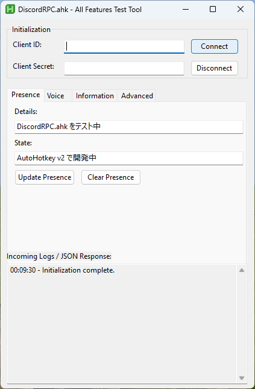

# Discord RPC for AutoHotkey v2

AutoHotkey (v2.0+) を使用して、外部 DLL に依存せずに Discord Rich Presence を実現する軽量かつ高機能なライブラリです。



## 特徴

- **純粋な AHK 実装**: 外部の DLL やモジュールを必要とせず、AHK スクリプトのみで動作します。
- **IPC 通信**: Discord クライアントと直接 IPC (Named Pipe) で通信します。
- **フル機能対応**: Presence の更新だけでなく、ボイス設定やギルド・チャンネル情報の取得、OAuth2 連携まで幅広くサポートしています。
- **非同期処理**: イベント駆動型の設計により、メインスレッドをブロックせずに処理を行います。

## インストール

`lib/` ディレクトリの内容を自身のプロジェクトにコピーして使用してください。

- `lib/DiscordRPC.ahk`: メインライブラリ
- `lib/JSON.ahk`: JSON 処理ライブラリ（必須）
- `lib/DotEnv.ahk`: 環境変数読み込み（任意、`Example.ahk` で使用）

## 使い方

### 基本的な Presence 更新

```autohotkey
#Requires AutoHotkey v2.0
#Include lib/DiscordRPC.ahk

; Client ID を指定して初期化
rpc := DiscordRPC("YOUR_CLIENT_ID")

; READY イベントを待機（任意）
rpc.On("READY", (data) => MsgBox("Connected as " . data.user.username))

; 接続開始
if (rpc.Connect()) {
    ; Presence を設定
    rpc.SetActivity({
        details: "テスト中",
        state: "AHK v2 を使用",
        assets: {
            large_image: "image_name",
            large_text: "Tooltip text"
        }
    })
}
```

## 利用可能な機能 (主要メソッド)

### Presence & Activity
- `SetActivity(details)`: Rich Presence を更新します。
- `ClearActivity()`: Presence を削除します。

### Voice Control
- `GetVoiceSettings()`: 現在のボイス設定（ミュート、スピーカーミュート等）を取得します。
- `SetMute(mute)`, `SetDeaf(deaf)`: ミュート状態を切り替えます。
- `ToggleMute()`, `ToggleDeaf()`: 現在の状態を反転させます。

### Information
- `GetGuilds()`, `GetChannels(guildId)`: サーバーやチャンネルの情報を取得します。
- `GetUser(userId)`: ユーザー情報を取得します。

### OAuth2 / Advanced
- `Authorize(scopes)`: ユーザー認可をリクエストします。
- `Authenticate(token)`: アクセストークンを使用して認証します。
- `CreateChannelInvite(channelId)`: 招待コードを生成します。

## テストツール (Example.ahk)

同梱の `Example.ahk` を実行すると、GUI 上で全機能をテストできます。
`.env` ファイルに `CLIENT_ID` や `CLIENT_SECRET` を記述しておくと、起動時に自動的に読み込まれます。
